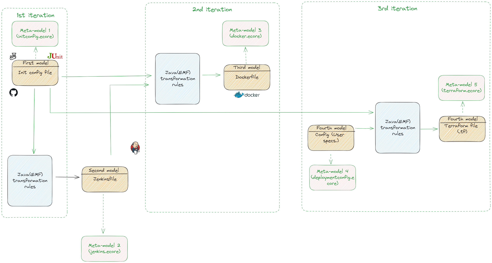

# Ecore

**Ecore** est un projet basé sur ingénierie dirigée par les modèles (MDE) qui vise à exploiter ses principes fondamentaux pour simplifier le processus de développement logiciel en mettant l'accent sur la création et la manipulation de modèles.

#### Pourquoi Ecore?

- *Simplicité de Configuration*: Avec **Ecore**, la configuration devient simple. Fournissez l'URL GitHub de votre projet et les itérations automatisées se chargent du reste. Éliminez la complexité des configurations manuelles, permettant ainsi aux développeurs de se concentrer davantage sur la conception et la qualité du code.
- *Déploiement Rapide et Fiable*: **Ecore** accélère le déploiement de votre application. En automatisant la génération de fichiers de configuration pour Jenkins, Docker, et la mise en place de l'infrastructure, le projet garantit un déploiement rapide et fiable, réduisant les erreurs humaines et les délais.
- *Réduction des Points de Friction*: **Ecore** vise à réduire les points de friction dans le développement logiciel. En automatisant des aspects critiques du cycle DevOps, le projet permet aux équipes de développement de se concentrer sur l'innovation, la qualité du code, et la création de valeur.

#### Objectif

En utilisant des concepts avancées de MDE, nous allons automatiser des tâches du cycle DevOps identifiées comme répétitives. Cette automatisation s'effectue à travers des itérations, chaque itération nécessite une transformation d'un modèle à un autre.

#### Fonctionnalités/Itérations

**Itération 1**: **Un fichier de configuration initiale** vers `JenkinsFile`, mettant ainsi en place le début du pipeline DevOps (Pipeline Implémenté).

**Itération 2**: **Un fichier de configuration** préparé vers un `DockerFile`, cette itération rend l'application portable et prête pour le déploiement(Image déployée dans un Docker Registry).

**Itération 3:** Création d'une **infrastructure** pour le déploiement, cette itération assure que l'application est prête à affronter les défis avec une infrastructure évolutive.

#### Comment ça fonctionne

Prenons un moment pour comprendre les étapes nécessaires pour tirer le meilleur parti de **Ecore** dans le contexte d'une application web. L'utilisateur est sensé entrer quelques informations spécifiques au projet.

##### Interagir avec l'application web: 

- Accédez à l'interface web de **Ecore**.

- Entrez `l'URL` GitHub de votre projet.

- Indiquez les informations d'identification du profil Jenkins à utiliser pour le pipeline.

- Fournissez les informations d'identification Docker nécessaires pour le déploiement de l'image.

- Spécifier les besoins de l'infrastructure voulue.

  
  
  
  
  #### Exigences du projet en entrée
  
  - Les tests sont regroupés dans un répertoire nommé `tests`.
  
  - Le token de Jenkins Api doit être placé dans ce fichier `/ressources/config.properties` , nommé par la suite **jenkins.api.token**.
  
  - Le répertoire doit être public.
  
    
  
  

